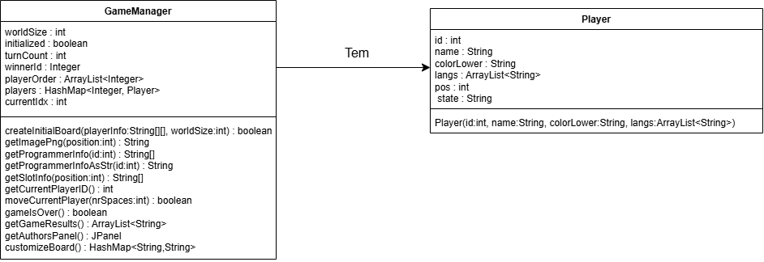

# The Great Programming Journey

Projeto desenvolvido no âmbito da unidade curricular **Linguagens de Programação II**  
Universidade Lusófona — Ano letivo 2025/26

---

## Autor
- **Nome:** Miguel Lopes
- **Número:** 22404033
- **Turma:** LP2-2D1

---

## Diagrama UML

O diagrama seguinte representa as classes do projeto e a sua relação:

